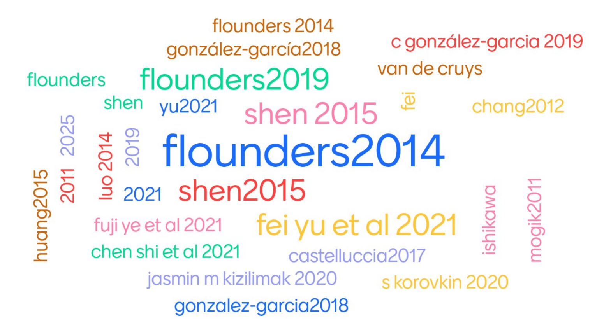

# Are there replications of Ludmer et al. (2011)?

As of 4th October 2022, this paper had 13 citations on Google Scholar.

On these articles, at least 18 were not in English, at least 10 were not published scientific articles, at least 3 were with a species other than humans, and at least one was a duplicate entry. In addition, at least 13 were reviews or theory articles rather than original data. This still leaves a lot of articles...

## Not on the neuroscience of the aha! effect

At least 53 of the remaining articles did not report fMRI data so could not be a replication, and at least 3 had fMRI data but were not on the aha! effect, so we're down to a smaller number of articles. Below are some examples of articles that cite Ludmer et al. (2011), but aren't fMRI studies of the aha! effect:

- Castelluccia et al. (2017, Network and Distributed System Security Symposium)

- Chang et al. (2012, Perceptual and Motor Skills)

- Chen et al. (2021, Acta Psychologica)

- Danek & Wiley (2020, Cognition)

- Du et al. (2017, Journal of Creative Behaviour)

- [Ishikawa & Mogi (2011, Cognitive Neurodynamics)](https://www.ncbi.nlm.nih.gov/pmc/articles/PMC3179546/pdf/11571_2011_Article_9171.pdf)

- Ishikawa et al. (2019, Frontiers in Psychology) 

- Kizilirmak et al. (2015, Psychological Research)

- Korovkin et al. (2020, Journal of Cognitive Psychology)

- Lin et al. (2018, Frontiers in human neuroscience)

- Luo et al. (2014, Human Brain Mapping)

- Shen et al. (2013, Science China Life Sciences)

- Shen et al. (2016, British Journal of Psychology)

- van de Cruys et al. (2021, Cognition)

## Not a replication attempt

Just because a study shows amygdala activation, or studies the aha! phenomenon, that doesn't necessarily mean it's a replication of Ludmer et al. (2011); it also needs to observe the substantially same result as Ludmer, i.e. that the activation of the amygdala correlates with later memory of the stimulus in an aha! procedure. 

Here are some examples of neuroscience studies citing Ludmer et al. (2011) that are not attempts to replicate Ludmer et al. (2011):

- [Becker et al. (2021, Journal of Cognitive Psychology)](https://www.researchgate.net/profile/Maxi-Becker/publication/343497974_Verbal_insight_revisited_-_Dissociable_neurocognitive_processes_underlying_solutions_accompanied_by_an_AHA_experience_with_and_without_prior_restructuring/links/5f312b1592851cd302ebff87/Verbal-insight-revisited-Dissociable-neurocognitive-processes-underlying-solutions-accompanied-by-an-AHA-experience-with-and-without-prior-restructuring.pdf) - Does not assess memory, nor investigate association of amygdala activation to memory.

- [Flounders et al. (2019, eLife)](https://elifesciences.org/articles/41861.pdf) - Uses Mooney images, but does not test memory for them after a delay. 

- [Gonzalez-Garcia et al. (2018, eLife)](https://elifesciences.org/articles/36068.pdf) - Uses Mooney images, but isn't investigating the same hypotheses as Ludmer et al (correlation of amygdala activation to memory)

- [Huang et al. (2015, NeuroImage)](http://39.105.135.139/media/files/30.pdf) - Does not assess relation between memory and amygdala activity.

- [Haung et al. (2018, NeuroImage)](http://39.105.135.139/media/files/47.pdf) - Does not measure retention after a delay.

- [Kozunov et al. (2020, NeuroImage)](https://www.ncbi.nlm.nih.gov/pmc/articles/PMC7762843/pdf/main.pdf) - Does not report activity of amygdala, does not assess correlation of memory with brain activity. 

- [Yu et al. (2021, Psychophysiology)](https://onlinelibrary.wiley.com/doi/abs/10.1111/psyp.13886?casa_token=t6vvyc2TFtEAAAAA:ePccXYPejXnA5tfId1d1JjAfc_UGhUYni004LHtVYbPd1zFuLLNhT5xg35pT7TZv7BHCfXkj9P3ygJg) - Did not test memory after a delay.

- [Wu et al. (2019, NeuroImage)](https://www.sciencedirect.com/science/article/pii/S1053811919305580) - does not test memory.

## Not a direct replication

There are a couple of studies that come pretty close to replicating Ludmer et al.:

- [Kizilrmak et al. (2016, Frontiers in Psychology)](https://www.frontiersin.org/articles/10.3389/fpsyg.2016.01693/full) - Table 4 shows something much like the Ludmer et al. (2011) result. It's not a direct replication, though, because it uses a different insight task (remote associates task) and a different retention interval (24 hours instead of one week).

- [Kizilirmak et al. (2019, Consciousness & Cognition)](https://reader.elsevier.com/reader/sd/pii/S105381001830566X?token=EF434E82863D4EEC007C609DB2C87EFB3B282F3718568C5B78B1C6CAE2465B4135C5FD80CA9ABD175525FD5232E683C1&originRegion=eu-west-1&originCreation=20211006091820) - For the current purposes, this is largely the same as Kizilirmak et al., (2016). There is some evidence for a similar effect to Kizilirmak et al. (2016), but the evidence is somewhat weaker this time (see p.121). 

## Conclusion

Overall, 130 other articles cite Ludmer et al. (2011), but none of them are direct replications of that study. This supports previous analysis, which shows that published attempts to directly replicate a study are rare in psychology [Makel et al., 2014](https://www.researchgate.net/profile/Matthew-Makel/publication/258180081_Replications_in_Psychology_Research_How_Often_Do_They_Really_Occur/links/00b49534d1bb6e6fe5000000/Replications-in-Psychology-Research-How-Often-Do-They-Really-Occur.pdf).  A direct replication is where you do the same thing and get the same result. The closest the field seems to have come in this case are a couple of studies that show a conceptually similar effect with a different insight task and a different (much shorter) retention interval. There is also the issue that, in the more recent study, the evidence for the result is somewhat weak. 

So, the answer to the question is not straight forward, as is often the case! We can say that there is not _direct_ replication, hence the phrasing of the poll in class. We might, however, argue that there is at least one _conceptual_ replication i.e. a result that supports the same general conclusion, but over a shorter time period and with different materials. The latter is arguably a good thing, i.e. it's good that we can show this effect has some generality. The former is more troublesome - for example, in the context of study skills advice, a retention interval of 24 hours is rather short. 
